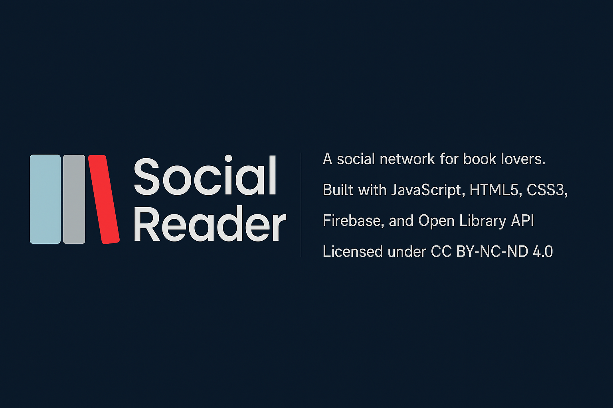

# 📚 SocialReader

---

> **SocialReader** es una red social para lectores donde los usuarios pueden compartir sus lecturas, reseñas y conectar con otros amantes de los libros.  
> El objetivo es ofrecer una experiencia de lectura social, sencilla y atractiva, combinando exploración de libros, creación de contenido y comunidad.

---

## ✨ Características principales

- 🔐 Registro e inicio de sesión con correo electrónico, Google o GitHub (próximamente Apple).
- 📚 Búsqueda de libros usando OpenLibrary API.
- 💖 Guardar libros en **Favoritos** y **Mostrar más tarde**.
- 📝 Crear reseñas de libros con valoraciones, texto y opción de spoilers.
- 🧑‍🤝‍🧑 Añadir amigos, gestionar contactos y ver sus reseñas.
- 🧩 Gestión del perfil de usuario (nombre, correo, avatar, fecha de alta).
- ⚡ Notificaciones tipo **toast** y modales personalizados para errores.
- 📱 Diseño responsive adaptable a móviles, tablets y escritorio.

---

## 🛠️ Tecnologías utilizadas

- **Frontend:**
  - HTML5, CSS3, JavaScript (ES6+)
  - Animaciones CSS personalizadas
  - Responsive Web Design

- **Backend:**
  - Firebase Authentication (correo, Google, GitHub)
  - Firebase Firestore Database (usuarios, reseñas)

- **APIs externas:**
  - OpenLibrary API (búsqueda y detalles de libros)

---

## 📂 Estructura del Proyecto

- **`/assets`**  
  - `/img`
    - `/avatars/` → Avatares de usuario.  
    - `/interface/` → Iconos e imágenes de la interfaz.  
    - `/logotipos/` → Logotipos del proyecto y banner del README.

- **`/js`**  
  - `/services/`
    - `firestoreService.js` → Funciones para interactuar con Firebase Firestore.
    - `openlibrary.js` → Funciones para interactuar con OpenLibrary API.
  - `firebase.js` → Configuración de Firebase.
  - `router.js` → Sistema de navegación entre vistas.
  - `login.js` → Lógica de inicio de sesión y registro.
  - `home.js` → Funcionalidad de la vista principal.
  - `search.js` → Funcionalidad de búsqueda de libros.
  - `detalles.js` → Funcionalidad de detalles de libros.
  - `profile.js` → Gestión del perfil de usuario.

- **`/styles`**  
  - `login.css` → Estilos de la vista de inicio de sesión.
  - `home.css` → Estilos de la vista principal.
  - `search.css` → Estilos de la vista de búsqueda.
  - `detalles.css` → Estilos de la vista de detalles de libros.
  - `profile.css` → Estilos de la vista de perfil.

- **`/views`**  
  - `login.html` → Vista de login y registro.
  - `home.html` → Vista de inicio.
  - `search.html` → Vista de búsqueda de libros.
  - `detalles.html` → Vista de detalles de libros.
  - `profile.html` → Vista de perfil de usuario.

- **Otros archivos**
  - `index.html` → Archivo principal que inicializa la aplicación.
  - `README.md` → Documentación del proyecto.

---

## 🚀 Estado actual del proyecto

| Funcionalidad | Estado |
|:--------------|:------:|
| Registro e inicio de sesión | ✅ |
| Búsqueda de libros | ✅ |
| Guardar en favoritos y mostrar más tarde | ✅ |
| Crear y ver reseñas | ✅ |
| Gestión de amigos | ✅ |
| Responsive Design y animaciones | ✅ |
| Gestión de errores | ✅ |

---

## 🎯 Futuras mejoras

- 🔎 Ampliar la búsqueda por género, idioma o fecha.
- 📈 Añadir estadísticas de lectura por usuario.
- 🔔 Implementar notificaciones entre amigos.
- 📚 Seguimiento de progreso de lectura por libro.
- 🎨 Personalización avanzada del perfil de usuario.

---

## 🧑‍💻 Autor

- **Ángel Martínez Ordiales**  
  📅 Año: 2025  
  🚀 Proyecto: **SocialReader**  

---

## 📜 Licencia

Este proyecto está bajo la licencia:

**Creative Commons Atribución-NoComercial-SinDerivadas 4.0 Internacional (CC BY-NC-ND 4.0)**.  
Puedes consultar los términos completos aquí:  
➡️ [Creative Commons Attribution-NonCommercial-NoDerivatives 4.0 International License](https://creativecommons.org/licenses/by-nc-nd/4.0/)

---

# ¡Gracias por visitar **SocialReader**! 🚀📖
